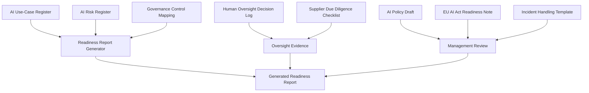

# Architecture

## Purpose

This document explains the architecture of the ISO42001 AI Governance Evidence Toolkit as a portfolio-grade readiness system.

The toolkit turns structured AI governance evidence into reviewable artefacts and a generated readiness report. It is intentionally lightweight, transparent and dependency-free.

## High-level flow

## Components

| Component | Purpose |
|---|---|
| `data/ai_use_case_register.csv` | Records AI use cases, owners, status, risk level and evidence references. |
| `data/ai_risk_register.csv` | Records risks, impact, likelihood, controls and next actions. |
| `data/control_mapping.csv` | Maps governance controls to objectives, owners, evidence and status. |
| `data/human_oversight_decision_log.csv` | Demonstrates review and escalation evidence for AI-assisted outputs. |
| `docs/ai_supplier_due_diligence_checklist.md` | Supports review of AI tools and suppliers. |
| `docs/eu_ai_act_risk_classification_note.md` | Provides readiness triage questions for EU AI Act risk conversations. |
| `docs/ai_incident_response_template.md` | Provides a template for AI incidents and complaints. |
| `src/generate_readiness_report.py` | Reads structured CSV artefacts and generates a Markdown readiness report. |
| `reports/sample_readiness_report.md` | Demonstrates the expected report output. |

## Design principles

1. Evidence-first governance: every claim should map to a register, control, owner or evidence reference.
2. Human accountability: AI outputs are treated as drafts or support, not final authority.
3. Practical SME readiness: the toolkit is lightweight enough for small organisations.
4. Safe positioning: the project does not claim legal advice, certification or formal audit status.
5. Repeatability: CI verifies that tests pass and the readiness report can be generated.

## Operational boundary

This is a readiness and portfolio toolkit. It is not a production GRC platform, legal advisory system or certification system. Real deployments should add organisation-specific review, access governance, record retention, approval workflow and management sign-off.
