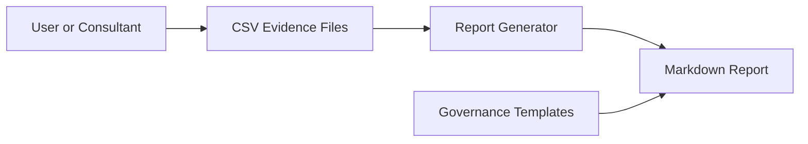

# Threat Model

## Scope

This threat model covers the portfolio version of the ISO42001 AI Governance Evidence Toolkit.

The toolkit handles sample governance data, generated reports and documentation templates. It does not process real client records by default.

## Assets

| Asset | Why it matters |
|---|---|
| AI use-case register | Shows AI systems, owners and risk levels. |
| AI risk register | Contains risk decisions and planned controls. |
| Supplier review notes | May contain procurement, privacy or security observations. |
| Generated readiness report | Summarises governance gaps and management actions. |
| Consulting offer / case study | Supports employer and client-facing positioning. |

## Trust boundaries

## Key risks and controls

| Risk | Impact | Existing control | Further hardening |
|---|---|---|---|
| Incorrect or incomplete CSV data | Misleading readiness report | Column validation in report generator | Add schema file and richer validation rules |
| Overstated compliance claims | Misleading portfolio or client positioning | Clear limitations in README and docs | Add review checklist before external use |
| Sensitive client data in samples | Confidentiality concern | Sample data only and no real client data | Add explicit sanitisation guidance |
| Broken report generation | Poor reliability | Unit tests and CI report generation | Add coverage threshold |
| Unreviewed supplier assumptions | Weak due diligence | Supplier checklist template | Add supplier evidence reference fields |
| Human oversight not documented | Weak accountability | Human oversight log sample | Add owner sign-off fields |

## Security assumptions

- The repository stores sample data only.
- Real organisations must adapt templates before use.
- No secrets, tokens or private client data should be committed.
- Generated reports should be reviewed by a human before being shared.

## Abuse-resistance notes

The toolkit is defensive and governance-focused. It does not automate high-impact decisions, connect to production systems or make final regulatory determinations.

## Recommended future controls

1. Add a `schema/` directory for CSV validation rules.
2. Add sample sanitisation guidance for client examples.
3. Add a reviewer sign-off section to generated reports.
4. Add optional PDF/HTML export with review metadata.
5. Add coverage threshold and markdown checks in CI.
